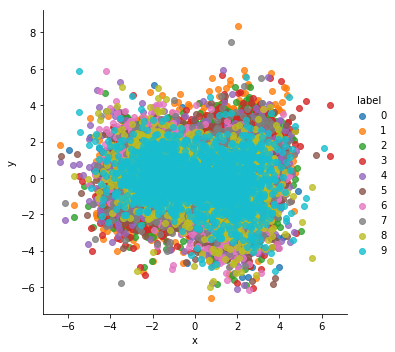

# Convolutional Variational Autoencoder implemented using PyTorch
> Implementation based on the [Auto Encoding Varational Bayes paper](https://arxiv.org/abs/1312.6114)

The Variational Autoencoder was trained on the Street View House Numbers ([SVHN](http://ufldl.stanford.edu/housenumbers/)) dataset.

**To run this project**
```
pip install -r requirements.txt
python svhn_vae.py
```

The dataset used can be easily changed to any of the ones available in the PyTorch datasets class ([docs](https://pytorch.org/docs/stable/torchvision/datasets.html)) or any other dataset of your choosing by changing the appropriate line in the code.

### Output of the network after 10 epochs


### Visualisation of the Latent Vector Space
After reduction to 2 dimensions using PCA


For a really good explanation of how these networks work, read [this](https://towardsdatascience.com/intuitively-understanding-variational-autoencoders-1bfe67eb5daf) article on Medium or [this](https://www.jeremyjordan.me/variational-autoencoders/) one by Jeremy Jordan. Both explain how these differ from traditional autoencoders as well as things to keep in mind while training such models.

