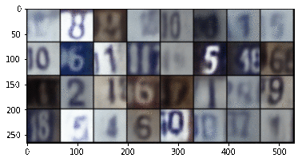

# Variational Autoencoder implemented using PyTorch

Implementation based on the following papers:
- [Auto Encoding Varational Bayes](https://arxiv.org/abs/1312.6114)
- [Variational Autoencoder for Deep Learning of Images, Labels and Captions](https://papers.nips.cc/paper/6528-variational-autoencoder-for-deep-learning-of-images-labels-and-captions.pdf)

Types of VAEs in this project
 - Vanilla VAE
 - Deep Convolutional VAE ( DCVAE )

The Vanilla VAE was trained on the [FashionMNIST](https://github.com/zalandoresearch/fashion-mnist) dataset while the DCVAE was trained on the Street View House Numbers ([SVHN](http://ufldl.stanford.edu/housenumbers/)) dataset.

**To run this project**
```
pip install -r requirements.txt
python main.py
```
Add the ` -conv ` arguement to run the DCVAE. By default the Vanilla VAE is run. You can play around with the model and the hyperparamters in the Jupyter notebook included.

The dataset used can be easily changed to any of the ones available in the PyTorch datasets class ([docs](https://pytorch.org/docs/stable/torchvision/datasets.html)) or any other dataset of your choosing by changing the appropriate line in the code.

### Output of the network after 10 epochs
#### Vanilla VAE


#### DCVAE


### Visualisation of the Latent Vector Space for the DCVAE
After reduction to 2 dimensions using PCA


For a really good explanation of how these networks work, read [this](https://towardsdatascience.com/intuitively-understanding-variational-autoencoders-1bfe67eb5daf) article on Medium or [this](https://www.jeremyjordan.me/variational-autoencoders/) one by Jeremy Jordan. Both explain how these differ from traditional autoencoders as well as things to keep in mind while training such models.

